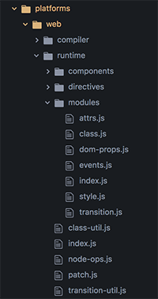

# Patch

## 简介

我们知道 patch 的主要就是为 vnode 生成真正的html。这里还包括attrs、class、events、style、dom-props 等的处理。本文主要介绍对events的处理，其它的style等雷同。先来一张图：



例图 A

## patch 函数的生成

```javascript
import { createPatchFunction } from 'core/vdom/patch'
import baseModules from 'core/vdom/modules/index'
import platformModules from 'web/runtime/modules/index'

const modules = platformModules.concat(baseModules)
export const patch: Function = createPatchFunction({ nodeOps, modules })

```

baseModules 和 platformModules 都是数组，数组中的每一项都是一个对象。对象的结构如下：

```javascript
{
    create: fn,
    update: fn
}
```

接下来我们看一下 createPatchFunction

```javascript
export function createPatchFunction (backend) {
  let i, j
  const cbs = {}
  const { modules, nodeOps } = backend
  // 收集所有的钩子函数到 cbs。
  for (i = 0; i < hooks.length; ++i) {
    cbs[hooks[i]] = []
    for (j = 0; j < modules.length; ++j) {
      if (isDef(modules[j][hooks[i]])) {
        cbs[hooks[i]].push(modules[j][hooks[i]])
      }
    }
  }
  
  function createElm (
    vnode,
    insertedVnodeQueue,
    parentElm,
    refElm,
    nested,
    ownerArray,
    index) {
     // 处理过后的代码
     createChildren(vnode, children, insertedVnodeQueue)
     if (isDef(data)) {
        invokeCreateHooks(vnode, insertedVnodeQueue)
     }
     insert(parentElm, vnode.elm, refElm)
  }
  
  // 这个就是真正的 patch 函数
  return function patch (oldVnode, vnode, hydrating, removeOnly) {
  	
  }
}
```
createElm 已经非常熟悉了，用来为vnode生成html的。那么html创建完成后，就需要调用 invokeCreateHooks 调用 create 钩子。

这些钩子可以干什么，可以处理事件、属性等各种情况，如图A，

比如拿事件举例：

```javascript
// platform/web/runtime/modules/events.js

function updateDOMListeners (oldVnode: VNodeWithData, vnode: VNodeWithData) {
  if (isUndef(oldVnode.data.on) && isUndef(vnode.data.on)) {
    return
  }
  const on = vnode.data.on || {}
  const oldOn = oldVnode.data.on || {}
  target = vnode.elm
  normalizeEvents(on)
  // import { updateListeners } from 'core/vdom/helpers/index'
  updateListeners(on, oldOn, add, remove, vnode.context)
  target = undefined
}

export default {
  create: updateDOMListeners,
  update: updateDOMListeners
}
```

updateListeners 做什么了呢？这里不列代码了，就是通过 addEventListener 和 removeEventListener 为 dom 绑定和移除事件的

